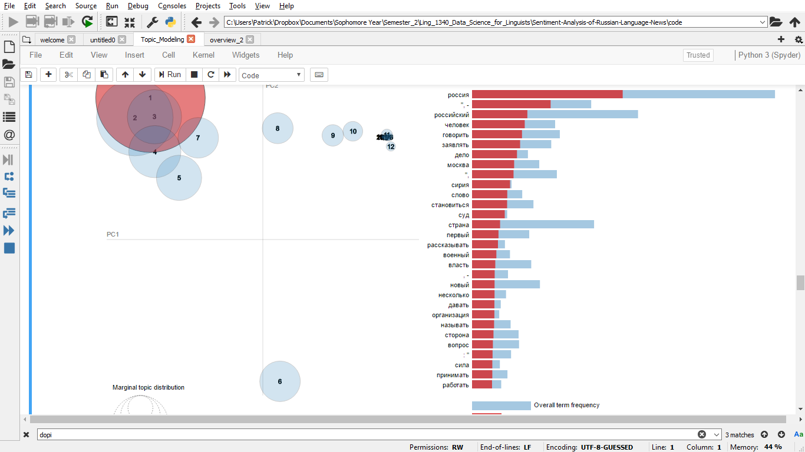

# Final Report - "Sentiment Analysis of Russian Language News"

## Introduction

The overall goal of this project was to examine the ways that news about Russia is discussed in Russian-language media by comparing sentiment of various news sources. Five news sites were chosen, running the gamut from Russian or American government controlled sources, to private organizations from in/outside of Russia. From those sites, a corpus of news articles was scraped, with the number of articles ranging from a few hundred to several thousand. After cleaning, topic modeling was performed on the corpus using Gensim's implementations of lda and lsa modeling.

## Data

The five news sites that were Radio Svoboda, BBC, Reuters, Kommersant, and TASS. Radio Svoboda is an American-controlled organization (in English known as Radio Free Europe/Radio Liberty), that originated from the merger of two Cold War Era anti-communist propaganda sources. Since the fall of communism, the organization has expanded and now broadcasts in over 20 countries that are controlled by authoritarian regimes. In contrast to this, TASS is a Russian government owned news agency and one of the largest news agencies in the world. TASS was founded several years after the Russian Revolution as the Telegrafnoe agentstvo Sovetskogo Soyuza (Telegraph Agency of the Soviet Union). Control of the organization was retained by the Russian Government after the collapse of the USSR. Two of the other organizations are privately owned. Kommersant is owned by the Uzbek-Russian billionaire magnate, Alisher Usmanov. Reuters is owned by the Canadian media conglomerate Thomson Reuters, whose majority owner is the Thomson family. Finally, the BBC is a publicly owned and funded British company. 

The data was scraped from articles mainly published from late 2018 to early 2019. The Python urllib module was used to get html source code from each site, and then this source code was parsed using the Beautiful Soup library. From each article, the title, date, and url was saved in a csv file, and the text was saved in a plain text file. 

In total 350 BBC articles, 5290 Kommersant articles, 2929 Radio Svoboda articles, 295 Reuters articles, and 3060 TASS articles were scraped. The reason for the small size of the BBC corpus was that the BBC site only showed 10 pages, with 35 articles each. Reuters only had 295 articles total on their Russian language site (I think those were just the only articles available for free). Examples of the articles scraped can be found [here](https://github.com/Data-Science-for-Linguists-2019/Sentiment-Analysis-of-Russian-Language-News/tree/master/data/data_sample) and csv files with title, date, and url can be found [here](https://github.com/Data-Science-for-Linguists-2019/Sentiment-Analysis-of-Russian-Language-News/tree/master/data/info).

The token count was 336593 (41719 types) for BBC, 2055141 (117152 types) for Kommersant, 708533 (57054 types) for Radio Svoboda, 91514 (14776 types) for Reuters, and 1067123 (79774 types) for TASS. BBC had the most words/article at 961.7, followed distantly by Kommersant (388.5), TASS (348.7), Reuters (310.2) and Radio Svoboda (241.9). The TTR was highest for Reuters, followed by BBC, Radio Svoboda, TASS, and finally Kommersant. This lines up neatly with the expectation that larger corpora have smaller TTRs.

### Issues with scraping

Some of the articles that were scraped had formatting issues. For the scrape of Kommersant, for example, I forgot to add newline characters after each section of the text was parsed. For some of them I also scraped non-text sections of the articles, which had weird results. Some of these I managed to fix, but some I did not, as can be seen in the topic model results.

## Topic Modeling

After collecting the data, I performed topic modeling on the corpus as well as each subcorpus using Gensim's implementations of both Latent Semantic Analysis (LSA) and Latent Dirochlet Allocation (LDA). I pre-processed the data by removing stopwords (using NLTK's Russian stopwords) and words such as names of each of the news source, which would occur fairly frequent but carry relatively little meaning. I then stemmed each of the words using pymystem3, which is a Python wrapper for Yandex's MyStem stemmer. This was a rather slow process so I stored the results of this preprocessing [here](https://github.com/Data-Science-for-Linguists-2019/Sentiment-Analysis-of-Russian-Language-News/tree/master/pickles). 

After pre-processing, I used Gensim's LDA and LSA functions. An example of my code for this entire process can be found [here](https://github.com/Data-Science-for-Linguists-2019/Sentiment-Analysis-of-Russian-Language-News/blob/master/code/bbc_lda.py). An example of the output is here for LDA is [here](https://github.com/Data-Science-for-Linguists-2019/Sentiment-Analysis-of-Russian-Language-News/blob/master/gensim/outputs/all_lda.txt) and for LSA is [here](https://github.com/Data-Science-for-Linguists-2019/Sentiment-Analysis-of-Russian-Language-News/blob/master/gensim/outputs/all_lsa.txt). 

After topic modeling with both LDA and LSA, I repeated this process with only the former method, examined some of the metrics that are used to evaluate topics and used PyLDAvis to create graphics illustrating each of the LDA models ([in this notebook](https://github.com/Data-Science-for-Linguists-2019/Sentiment-Analysis-of-Russian-Language-News/blob/master/Topic_Modeling.ipynb)). While the PyLDAvis graphics do not show up on github, they should work if the file is downloaded and opened normally (at least they work when I try that). I also tried to see how the results changed when bigram and trigram models were used. I only created n-gram models on the overall corpus (rather than each individual ) &#151 when making those models, I used a threshold of 5, meaning that only bigrams and trigrams that appeared 5 or more times in the corpus were added. 

The following three pictures represent the topics modeled using the unigram, bigram, and trigram model on the overall corpus. Perplexity and Coherence are listed below each model.

   
Perplexity:  -12.892946261137208  
Coherence Score:  -4.6520907968147736 
   
Perplexity:  -13.857436389243043 
Coherence Score:  -15.401022406485135 
   
Perplexity:  -14.189050171620696   
Coherence Score:  -16.200167920704946   

Perplexity is a measure of how well a model predicts a sample. A lower score is better. Coherence measures how coherent topics produced are. There are various ways to measure coherence; for my test I used UMass coherence. A higher score (closer to zero) is better. As is evident perplexity scores improve when bigram or trigram models are used. The coherence decreases, but this could be an artifact of the type of coherence measured. UMass coherence is calculated by comparing adjacent words. Since adjacent words that cooccur frequently will be joined together in the n-gram models, the UMass coherence will likely be affected. Taking that into consideration and considering the perplexity score, it seems that a bigram or trigram model could be useful. On the other hand, the bigram and trigram models seem to have a lot more of the topics clustered together, while the unigram model has the topics more spread out, with less overlap, which seems better.

Here are representations of the topics of each of the subcorpora. 

   
Perplexity:  -11.173775661178553  
Coherence Score:  -5.303740610278842 
   
Perplexity:  -11.714378145566323  
Coherence Score:  -3.3017339509175363 
   
Perplexity:  -9.779172000157132 
Coherence Score:  -4.328431024360861 
   
Perplexity:   -12.550488983999239 
Coherence Score:  -5.575851768761869 
   
Perplexity:  -11.09556895854912  
Coherence Score: -6.6816518575324455 

Of the scores produced by the topic modelling, the Reuters has the worst perplexity while Radio Svoboda has the best; Kommersant has the best coherence, while TASS has the worst. All of the subcorpora have a worse perplexity score than the overall corpus. However, the overall corpus's coherence score is comparable to the coherences of the subcorpora. 

Below is an example of a topic from one of these models (Radio Svoboda). The words in the topic are very coherent, including things like "олимпийский"(Olympic), "спортсмен" (athlete), "Сочи" (Sochi), "антидопинговый" (anti-doping), "медаль" (medal), "золотой" (gold), and "игра" (game). Clearly, this topic is about the Sochi olympics, and probably the fairly recent Russian doping scandal. 

On the other hand, some topics were not very good. This one from BBC includes words like Russia, Russian, Moscow, country, government, person, organization. While the topic is coherent, it's far too vague to be meaningful. 

A final example is also from the BBC subcorpus and is likely the result of bad scraping on my part. It again makes sense that these words would be put into a topic, but nevertheless the topic is pretty useless.

## Conclusion

Overall, I'm happy with some aspects of this project, but there are a lot of things that I would like to do in the future as I learn more about NLP. I feel satisfied with the web-scraping that I did in this project (although some improvements could have been made, for example the stuff in topic 6 from the BBC subcorpus in the last image). I would have liked to be able to use more advanced techniques to look at the biases that likely exist in the subcorpora and, for example, compare how each source talks about Putin, Trump, Russia, America, and so on. Nevertheless, I feel that topic modeling was a rewarding thing to use and the experience I gained with it is valuable. I would however like to gain a deeper understanding of how LDA and LSA work, and what the perplexity and coherence scores are measuring. Hopefully, as I learn more about natural language processing, I will gain this knowledge, and will be able to do better, more thorough research on the data set that I've already collected.
 
